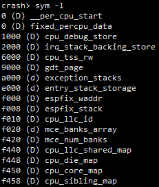

<!-- MDTOC maxdepth:6 firsth1:1 numbering:0 flatten:0 bullets:1 updateOnSave:1 -->

- [sym](#sym)   
   - [帮助手册](#帮助手册)   
   - [常见用法](#常见用法)   
      - [列出所有符号](#列出所有符号)   

<!-- /MDTOC -->

# sym


## 帮助手册

```
NAME
  sym - translate a symbol to its virtual address, or vice-versa

SYNOPSIS
  sym [-l] | [-M] | [-m module] | [-p|-n] | [-q string] | [symbol | vaddr]

DESCRIPTION
  This command translates a symbol to its virtual address, or a static
  kernel virtual address to its symbol -- or to a symbol-plus-offset value,
  if appropriate.  Additionally, the symbol type is shown in parentheses,
  and if the symbol is a known text value, the file and line number are shown.

              -l  dumps all symbols and their values.
              -M  dumps the current set of module symbols.
       -m module  dumps the current set of symbols for a specified module.
              -p  display the target symbol and the previous symbol.
              -n  display the target symbol and the next symbol.
       -q string  searches for all symbols containing "string".
          symbol  a kernel text or data symbol.
           vaddr  a kernel virtual address.

  If the "symbol", "vaddr" or "string" argument resolves to a module
  symbol, then the module name will be displayed in brackets following the
  symbol value.

EXAMPLES
  Translate data symbol jiffies to its value, and vice-versa:

    crash> sym jiffies
    c0213ae0 (D) jiffies

    crash> sym c0213ae0
    c0213ae0 (D) jiffies

  Translate a text address to its symbolic value and source file:

    crash> sym c0109944
    c0109944 (T) system_call+0x34  ../linux-2.2.5/arch/i386/kernel/signal.c: 723

  Dump the whole symbol table:

    crash> sym -l
    c0100000 (T) _stext
    c0100000 (A) _text
    c0100000 (t) startup_32
    c0100000 (T) stext
    c01000a4 (t) checkCPUtype
    c0100139 (t) is486
    c0100148 (t) is386
    c01001b1 (t) L6
    c01001b3 (t) ready
    c01001b4 (t) check_x87
    c01001da (t) setup_idt
    c01001f7 (t) rp_sidt
    c0100204 (T) stack_start
    c010020c (t) int_msg
    c0100220 (t) ignore_int
    c0100242 (t) idt_descr
    c0100244 (T) idt
    c010024a (t) gdt_descr
    c010024c (T) gdt
    c0101000 (T) swapper_pg_dir
    c0102000 (T) pg0
    c0103000 (T) empty_bad_page
    c0104000 (T) empty_bad_page_table
    c0105000 (T) empty_zero_page
    ...

  Find all symbols containing the string "pipe":

    crash> sym -q pipe
    c010ec60 (T) sys_pipe  
    c012f660 (t) pipe_read  
    c012f7b8 (t) pipe_write  
    c012f9c0 (t) pipe_lseek  
    c012f9d0 (t) bad_pipe_r  
    c012f9dc (t) bad_pipe_w  
    c012f9e8 (t) pipe_ioctl  
    c012fa18 (t) pipe_poll  
    c012fb00 (t) pipe_release  
    c012fb48 (t) pipe_read_release  
    c012fb5c (t) pipe_write_release  
    c012fb70 (t) pipe_rdwr_release  
    c012fba0 (t) pipe_read_open  
    c012fbb0 (t) pipe_write_open  
    c012fbc0 (t) pipe_rdwr_open  
    c012fbec (t) get_pipe_inode  
    c012fcc4 (T) do_pipe  
    c023a920 (D) read_pipe_fops  
    c023a960 (D) write_pipe_fops  
    c023a9a0 (D) rdwr_pipe_fops  
    c023a9e0 (D) pipe_inode_operations  

  Dump the symbols of the uart401 module, both before, and then after,
  the complete set of symbols are loaded with the "mod -s" command:

    crash> sym -m uart401
    c8032000 MODULE START: uart401
    c8032138 (?) uart401intr  
    c803235c (?) attach_uart401  
    c8032638 (?) probe_uart401  
    c80326d4 (?) unload_uart401  
    c8033770 MODULE END: uart401
    crash> mod -s uart401
     MODULE   NAME         SIZE  OBJECT FILE
    c8032000  uart401      6000  /lib/modules/2.2.14/misc/uart401.o
    crash> sym -m uart401
    c8032000 MODULE START: uart401
    c8032050 (t) my_notifier_call  
    c8032084 (t) uart401_status  
    c8032098 (t) uart401_cmd  
    c80320a8 (t) uart401_read  
    c80320bc (t) uart401_write  
    c80320cc (t) uart401_input_loop  
    c8032138 (T) uart401intr  
    c8032168 (t) uart401_open  
    c80321c8 (t) uart401_close  
    c80321f4 (t) uart401_out  
    c80322ac (t) uart401_start_read  
    c80322b4 (t) uart401_end_read  
    c80322bc (t) uart401_kick  
    c80322c4 (t) uart401_buffer_status  
    c80322cc (t) enter_uart_mode  
    c803235c (T) attach_uart401  
    c803259c (t) reset_uart401  
    c8032638 (T) probe_uart401  
    c80326d4 (T) unload_uart401  
    c8032760 (T) init_module
    c80327cc (T) cleanup_module  
    c8032b00 (d) sound_notifier  
    c8032b0c (d) detected_devc  
    c8032b20 (d) std_synth_info  
    c8032bc0 (d) std_midi_synth  
    c8033600 (d) uart401_operations  
    c80336c4 (D) io  
    c80336c8 (D) irq  
    c80336e0 (b) hw_info.508  
    c8033770 MODULE END: uart401

  Display the value of jiffies, along with the next and previous symbols:

    crash> sym -np jiffies
    c023027c (D) prof_shift
    c0230280 (D) jiffies
    c02302a0 (D) task

  Translate a symbol value to its name and module:

    crash> sym f88878d1
    f88878d1 (t) ext3_readdir [ext3]
    crash>
```

## 常见用法

### 列出所有符号

```
sym -l
```



crash下可以直接重定向导出


```
129646 log.sym
```

左侧是地址，中间是类型，右测是符号名

```
(A)
(b)
(B)
(d)
(D)
MODULE END
MODULE START
(r)
(R)
(t)
(T)
(V)
(w)
(W)
```


---
