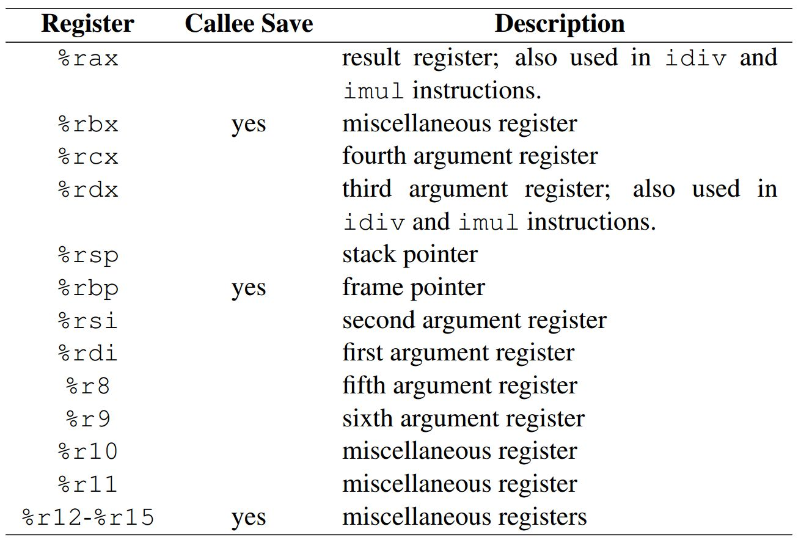
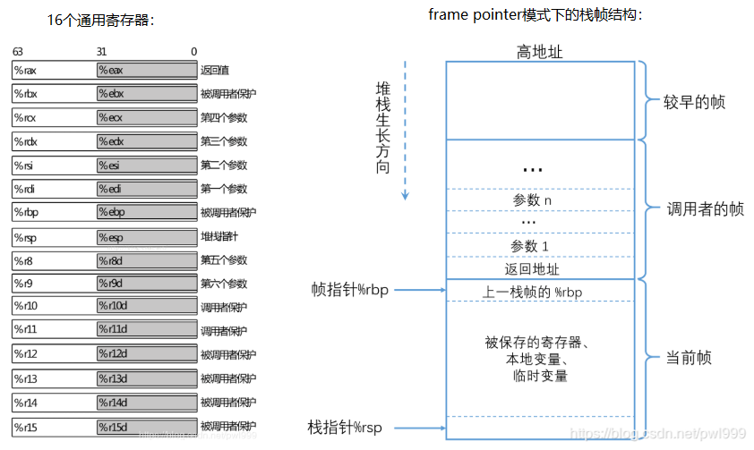
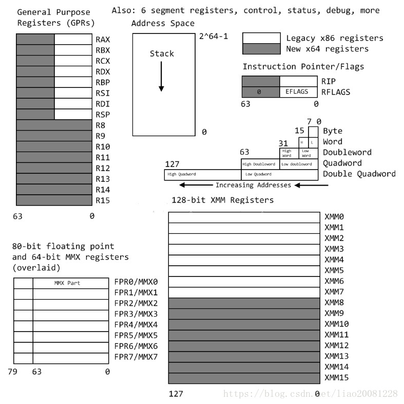

# X86堆栈


## x86_64位系统传参

对于 x86-64 架构，共有16个64位通用寄存器，各寄存器及用途如下图所示：



* 每个寄存器的用途并不是单一的。
* %rax 通常用于存储函数调用的返回结果，同时也用于乘法和除法指令中。
* 在imul 指令中，两个64位的乘法最多会产生128位的结果，需要 %rax 与 %rdx 共同存储乘法结果，在div 指令中被除数是128 位的，同样需要%rax 与 %rdx 共同存储被除数。
* %rsp 是堆栈指针寄存器，通常会指向栈顶位置，堆栈的 pop 和push 操作就是通过改变 %rsp 的值即移动堆栈指针的位置来实现的。
* %rbp 是栈帧指针，用于标识当前栈帧的起始位置
* %rdi, %rsi, %rdx, %rcx,%r8, %r9 六个寄存器用于存储函数调用时的6个参数（如果有6个或6个以上参数的话）。
* 被标识为 “miscellaneous registers” 的寄存器，属于通用性更为广泛的寄存器，编译器或汇编程序可以根据需要存储任何数据。






## 内平栈/外平栈

```
callq  0xffffffffaf98f930 <__crash_kexec>
```

* callq 跳转，先把下一个指令地址放到栈中，然后就是0xffffffffaf98f930代码处执行
* 0xffffffffaf98f930，自行处理压入参数，弹bp，修正sp，保持堆栈平衡
* 函数自己出创建栈自己完成栈平衡操作


```
push bp // 保存bp指针
mov bp,sp   // sp指向bp，此时sp与bp平起平坐，栈顶=栈底
push A
push B
push C
push D       // sp向下延伸，bp保持不动
```


```
函数结束时
mov sp,bp   // 将sp打回原形，回退到bp状态，实则为调用者的栈顶
pop bp      // 与此同时bp也要打回原形，回退到调用者的栈底
ret
```


## demo

```
long myfunc(long a, long b, long c, long d,
            long e, long f, long g, long h)
{
    long xx = a * b * c * d * e * f * g * h;
    long yy = a + b + c + d + e + f + g + h;
    long zz = utilfunc(xx, yy, xx % yy);
    return zz + 20;
}
```


## 参考

* <https://eli.thegreenplace.net/2011/09/06/stack-frame-layout-on-x86-64/>

---
