<!-- MDTOC maxdepth:6 firsth1:1 numbering:0 flatten:0 bullets:1 updateOnSave:1 -->

- [kdump](#kdump)   
   - [安装kexec-tools](#安装kexec-tools)   
   - [kexec-tools包内容](#kexec-tools包内容)   
   - [kdump/kexec原理](#kdumpkexec原理)   
   - [OpenEuler社区kdump分享](#openeuler社区kdump分享)   

<!-- /MDTOC -->
# kdump

## 安装kexec-tools

* kexec-tools是kdump/kexec所在包

安装方式：

```
yum install kexec-tools
```

kexec-tools包介绍：

```
Name        : kexec-tools
Version     : 2.0.15
Release     : 51.el7_9.3
Architecture: x86_64
Install Date: Tue 15 Mar 2022 02:42:21 AM UTC
Group       : Applications/System
Size        : 788973
License     : GPLv2
Signature   : RSA/SHA256, Fri 11 Jun 2021 03:04:32 PM UTC, Key ID 24c6a8a7f4a80eb5
Source RPM  : kexec-tools-2.0.15-51.el7_9.3.src.rpm
Build Date  : Wed 09 Jun 2021 04:10:00 PM UTC
Build Host  : x86-01.bsys.centos.org
Relocations : (not relocatable)
Packager    : CentOS BuildSystem <http://bugs.centos.org>
Vendor      : CentOS
Summary     : The kexec/kdump userspace component.
Description :
kexec-tools provides /sbin/kexec binary that facilitates a new
kernel to boot using the kernel's kexec feature either on a
normal or a panic reboot. This package contains the /sbin/kexec
binary and ancillary utilities that together form the userspace
component of the kernel's kexec feature.
```

Ubuntu下对应的包为  ```linux-crashdump```


## kexec-tools包内容

```
[root@centos7-crash ~/rpmbuild/RPMS/x86_64/kexec-tools]# tree
.
├── etc
│   ├── kdump.conf
│   ├── makedumpfile.conf.sample
│   └── sysconfig
│       └── kdump
├── sbin
│   ├── kexec
│   ├── makedumpfile
│   ├── mkdumprd
│   └── vmcore-dmesg
├── usr
│   ├── bin
│   │   └── kdumpctl
│   ├── lib
│   │   ├── dracut
│   │   │   └── modules.d
│   │   │       └── 99kdumpbase
│   │   │           ├── kdump-capture.service
│   │   │           ├── kdump-emergency.service
│   │   │           ├── kdump-emergency.target
│   │   │           ├── kdump-error-handler.service
│   │   │           ├── kdump-error-handler.sh
│   │   │           ├── kdump.sh
│   │   │           ├── module-setup.sh
│   │   │           └── monitor_dd_progress
│   │   ├── kdump
│   │   │   ├── kdump-lib-initramfs.sh
│   │   │   └── kdump-lib.sh
│   │   ├── systemd
│   │   │   ├── system
│   │   │   │   └── kdump.service
│   │   │   └── system-generators
│   │   │       └── kdump-dep-generator.sh
│   │   └── udev
│   │       ├── kdump-udev-throttler
│   │       └── rules.d
│   │           └── 98-kexec.rules
│   └── share
│       ├── doc
│       │   └── kexec-tools-2.0.15
│       │       ├── COPYING
│       │       ├── fadump-howto.txt
│       │       ├── kdump-in-cluster-environment.txt
│       │       ├── kexec-kdump-howto.txt
│       │       ├── News
│       │       ├── supported-kdump-targets.txt
│       │       └── TODO
│       ├── kdump
│       └── man
│           ├── man5
│           │   ├── kdump.conf.5.gz
│           │   └── makedumpfile.conf.5.gz
│           └── man8
│               ├── kdumpctl.8.gz
│               ├── kexec.8.gz
│               ├── makedumpfile.8.gz
│               ├── mkdumprd.8.gz
│               └── vmcore-dmesg.8.gz
└── var
    └── crash

24 directories, 36 files
```


## kdump/kexec原理


## OpenEuler社区kdump分享

* <https://www.bilibili.com/video/BV1M64y1Q7yp/?spm_id_from=333.788.recommend_more_video.0>

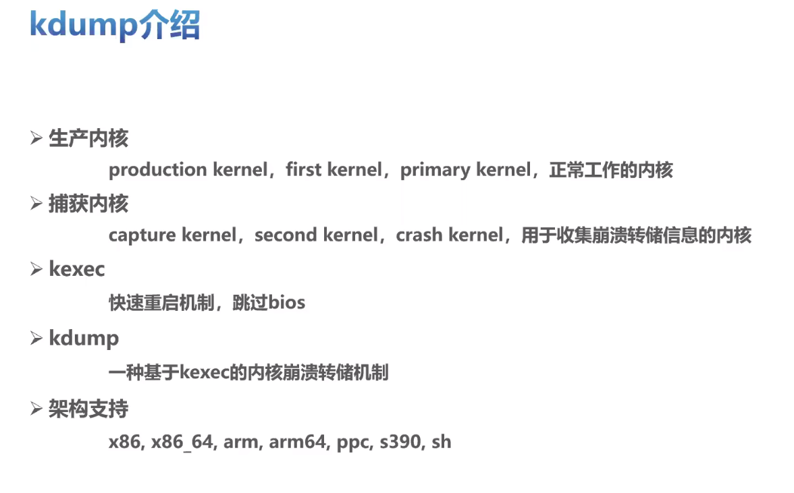

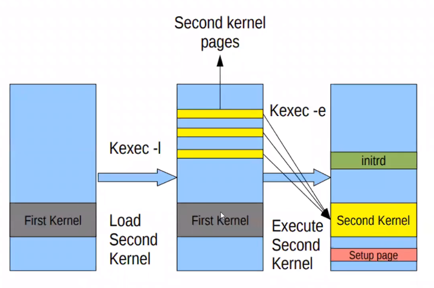

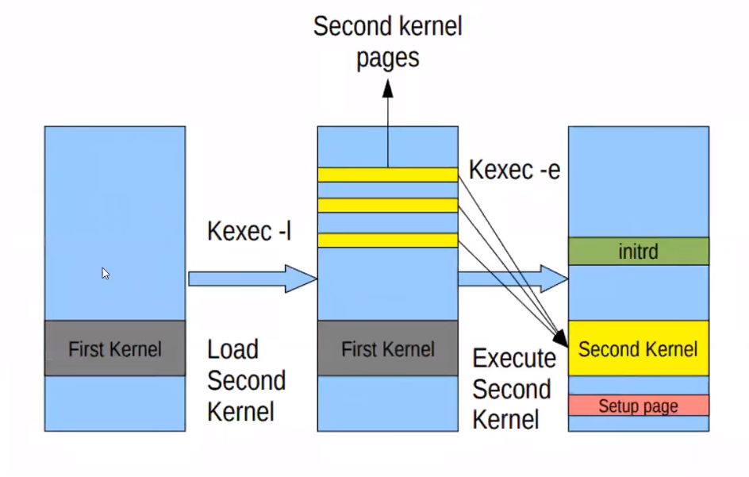

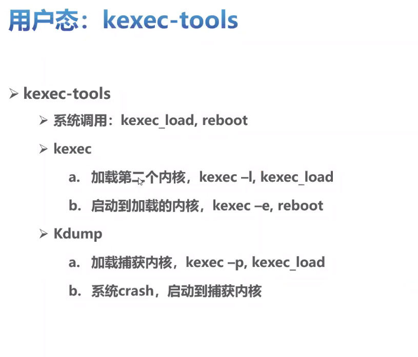


系统调用kexec_load

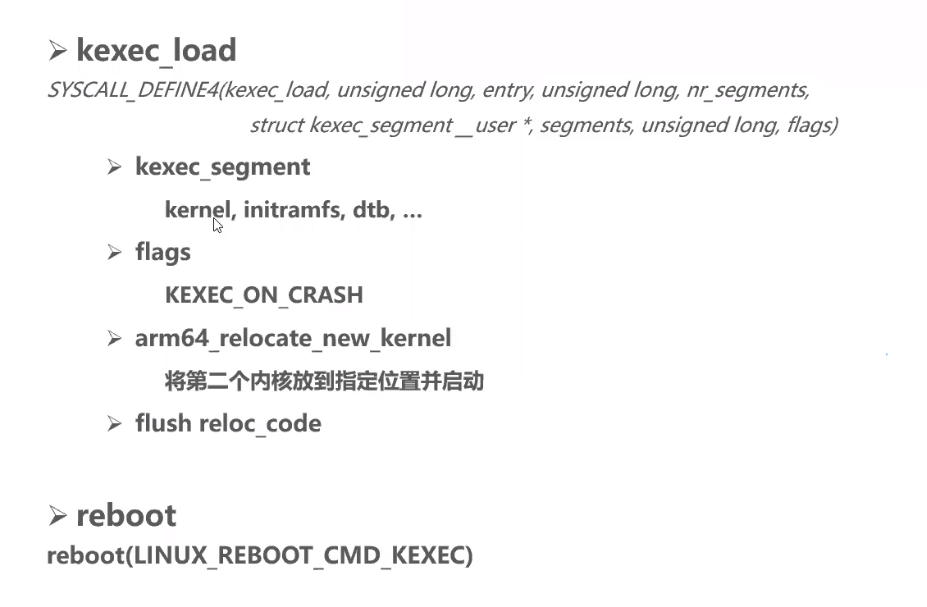

flag标记不同，当前状态不同，执行逻辑不同。crash与手动触发快速进入第二内核

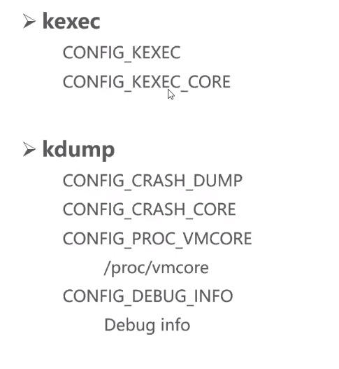

kexec与kdump，kdump依赖于kexec；kexec提供最基本的核心功能


预留内存查看


预留内存大小评估

1. 捕获内核启动CPU个数
2. Kernel、initrd、device
3. 通常256MB 或 512MB 足矣

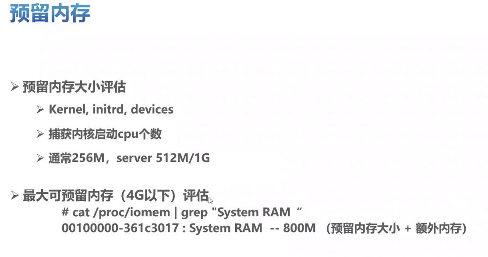

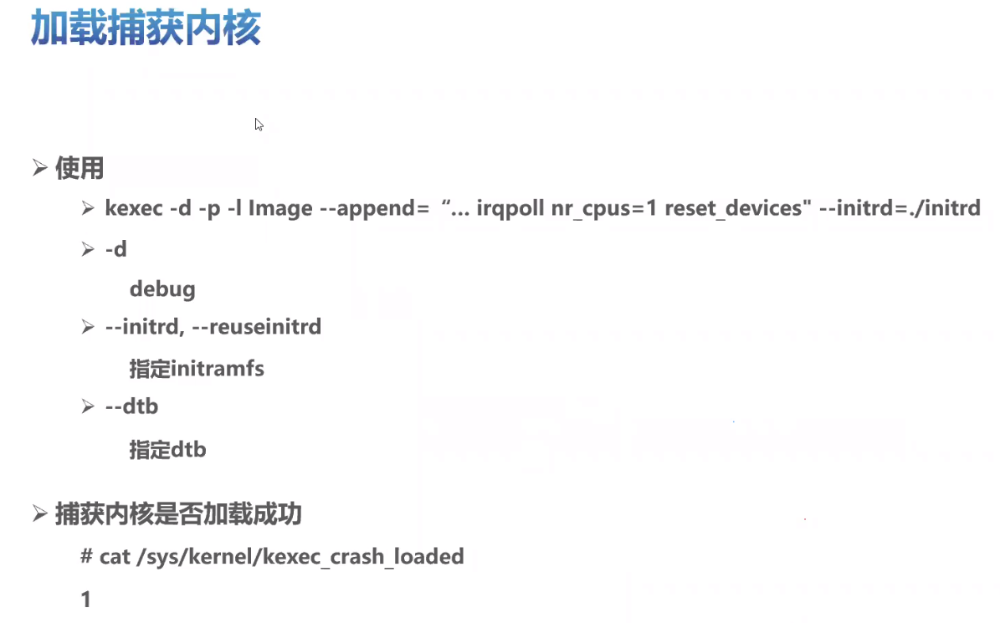

crash/oops触发时执行

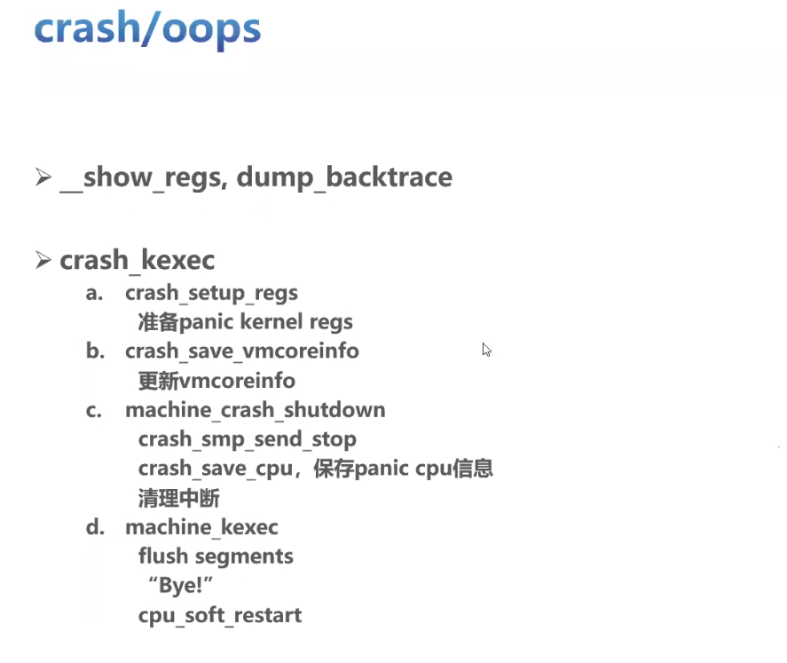


使用makedumpfile做页面过滤、压缩，缩减体积

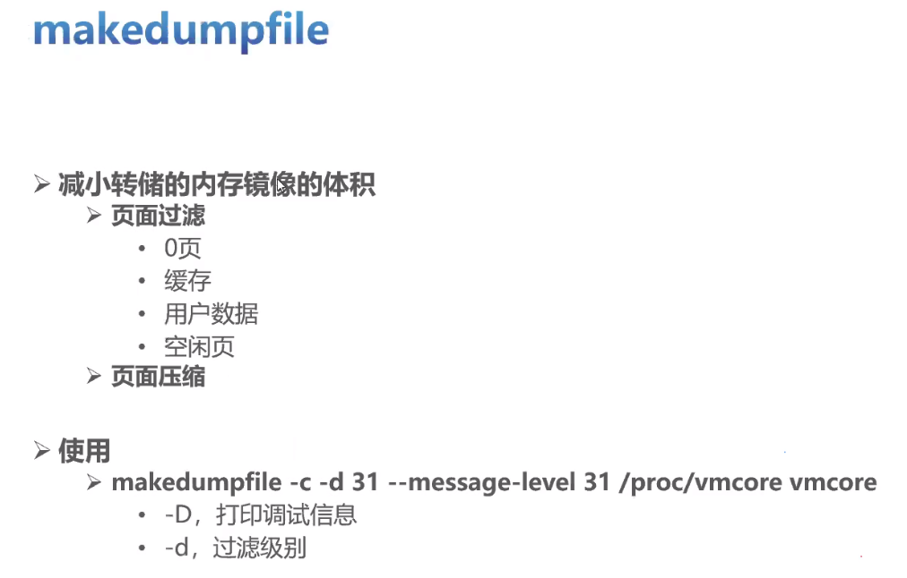

Kdump服务

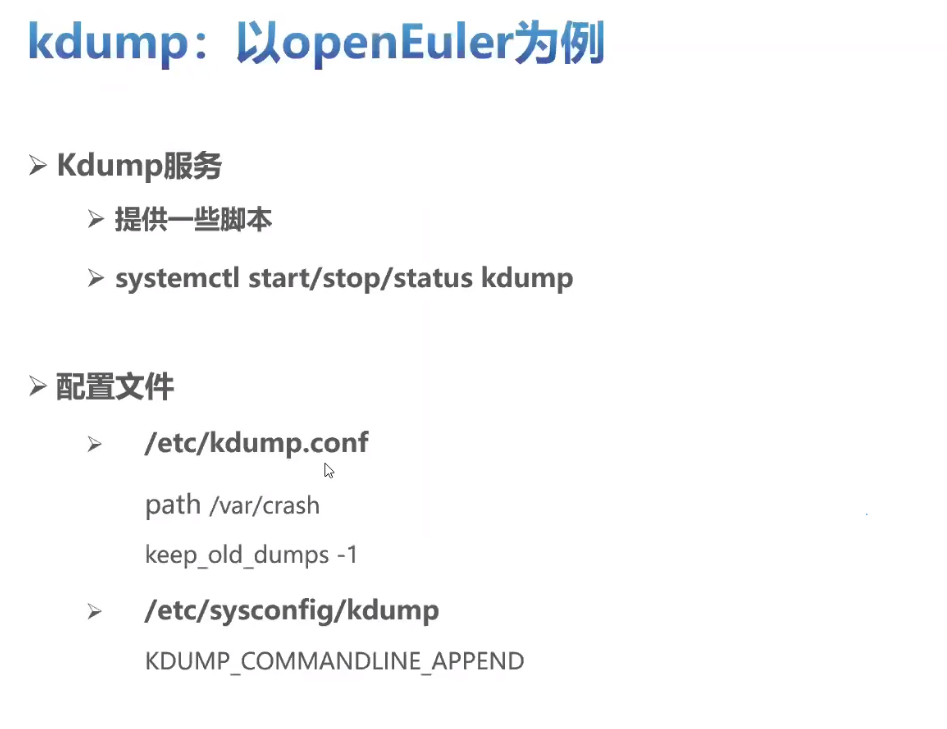


demo案例

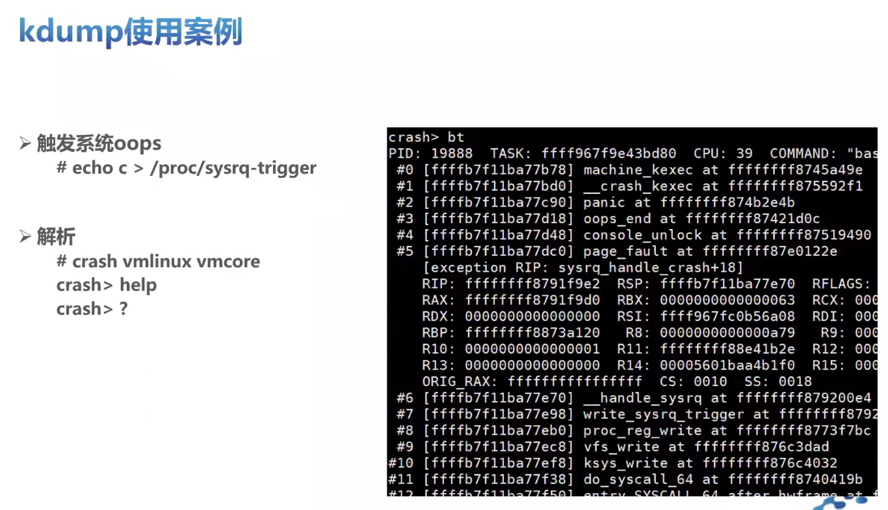

crash常用命令

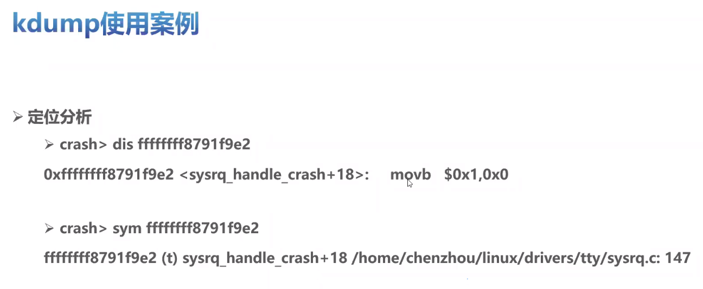


kdump使用可能遇到的问题


对于硬件问题，是最难搞得

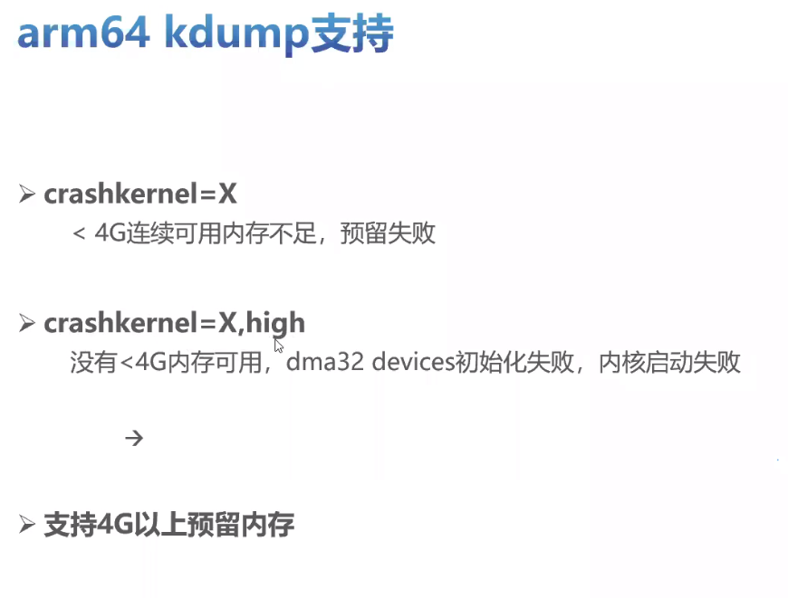

ARM架构，4G以上预留内存后，0~4G不会在预留内存

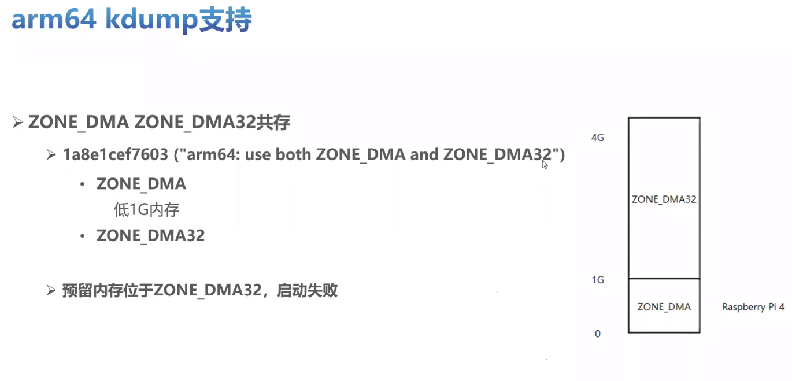

ARM64预留内存策略

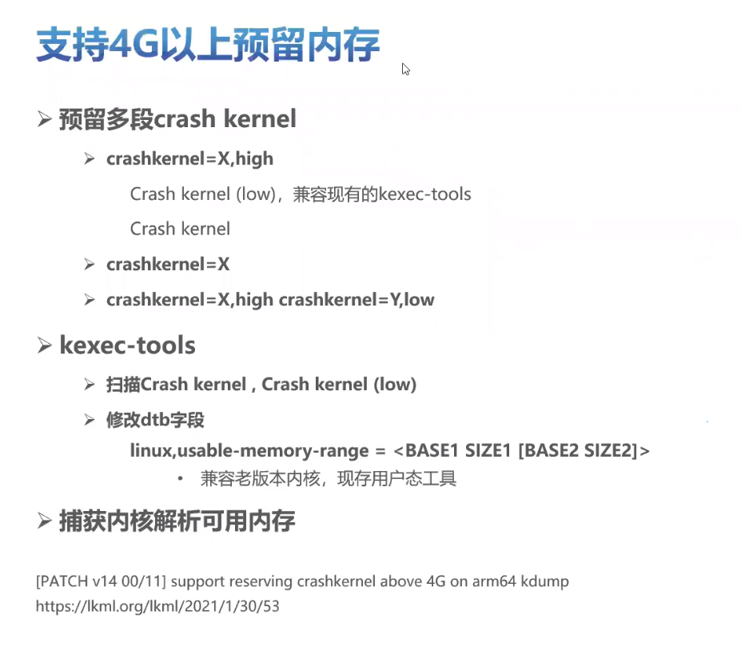


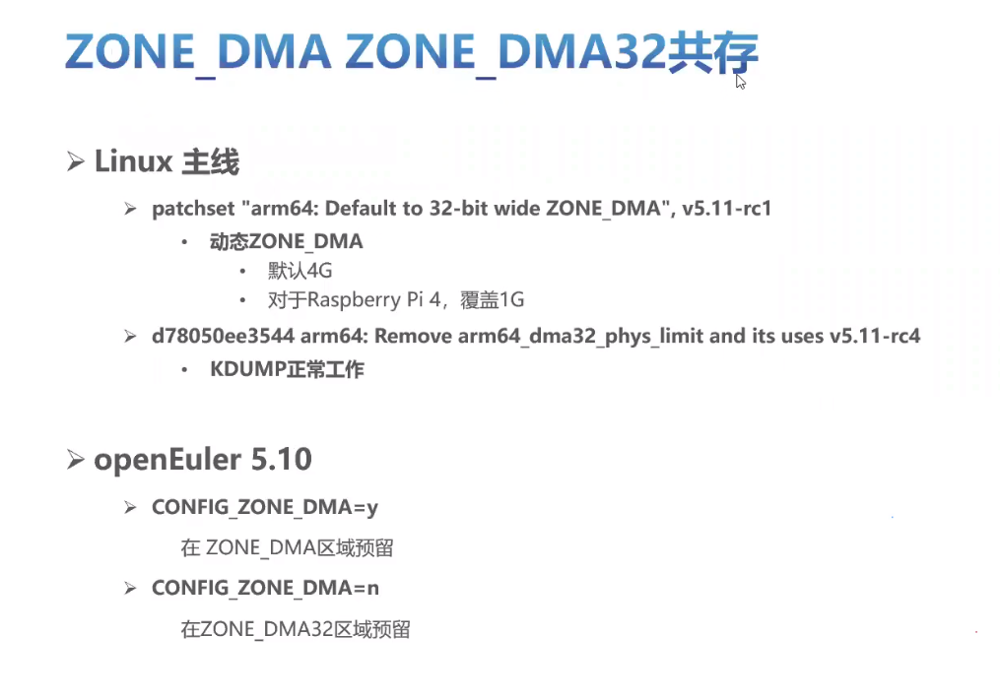

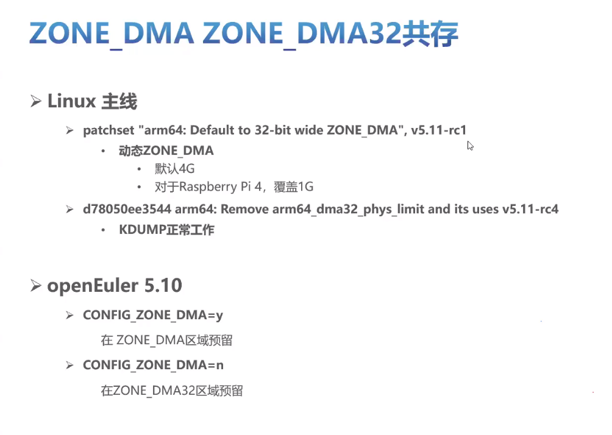


## 参考

* <https://pwl999.blog.csdn.net/article/details/118418242>

---
